# Conduit chain performance report

===== Ethereum Transaction Metrics =====
Total Number of Transactions: 99998
Total Gas Used: 2772887714
Total Time Period: 321.35 seconds
Transactions Per Second (TPS): 311.18 tx/s
Gas Used Per Second: 8628817.35 gas/s
Median Time to Inclusion: 2594.00 ms
Mean Time to Inclusion: 2969.55 ms
=========================================
## Histogram of Transaction Confirmation Times

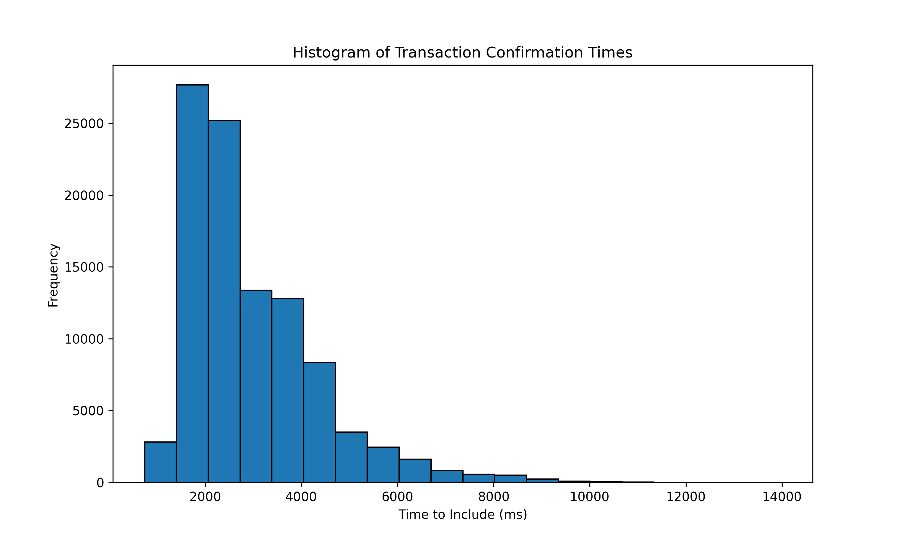

## Time Series of Confirmation Times (Sampled 0.5%)

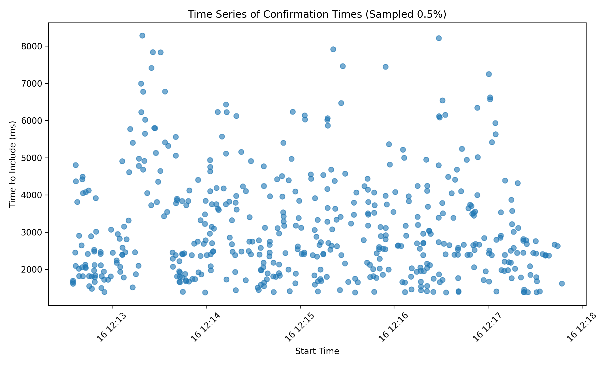

## Confirmation Times by Transaction Type

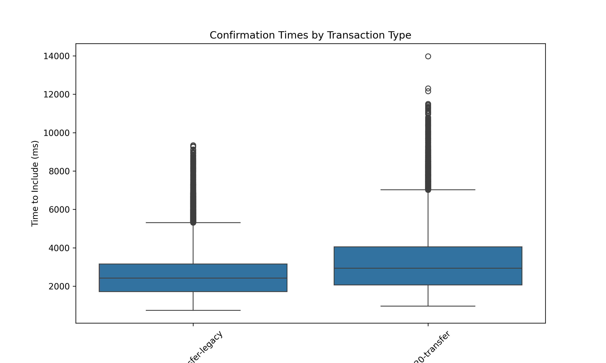

## Histogram of Gas Used

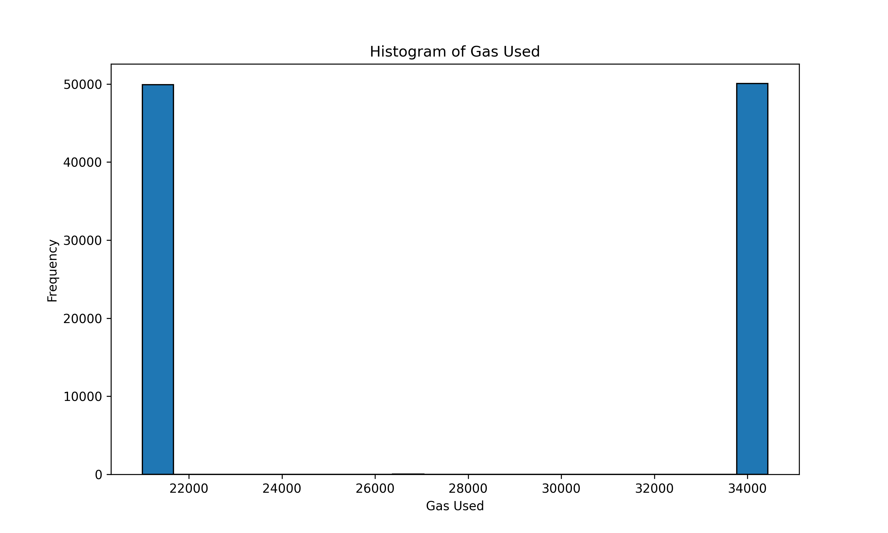

## Average Gas Used per Transaction Type

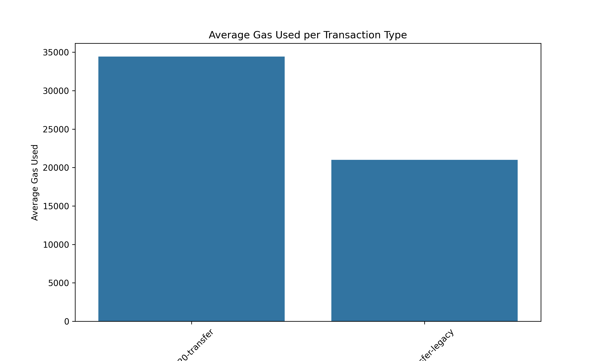

## Gas Used vs. Confirmation Time

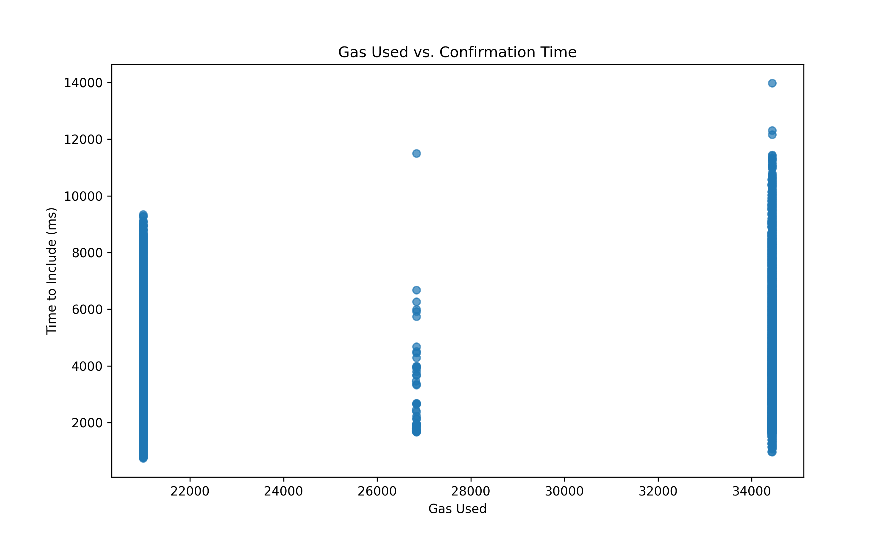

## Transaction Count Over Time

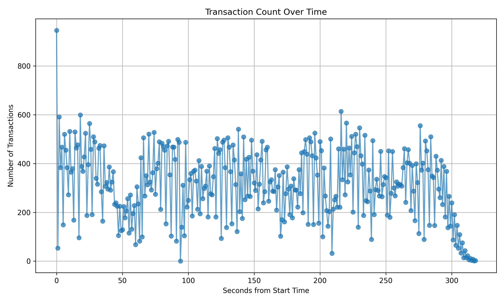

## Distribution of Transaction Types

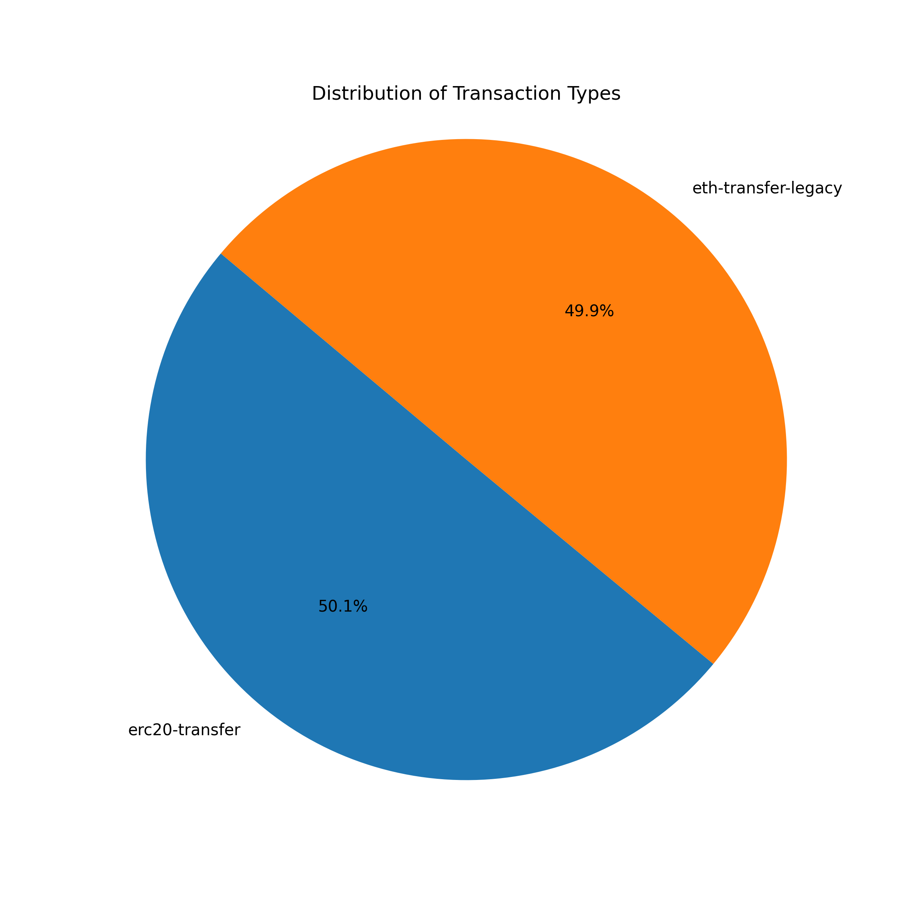

## Cumulative Gas Used Over Time

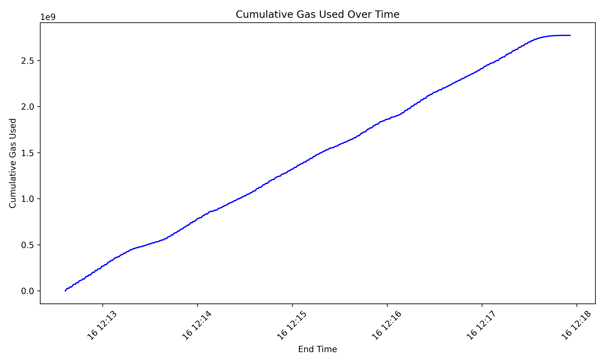

## Average Confirmation Time per Block

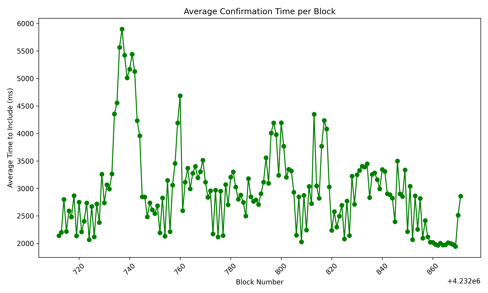

## Transactions per Block

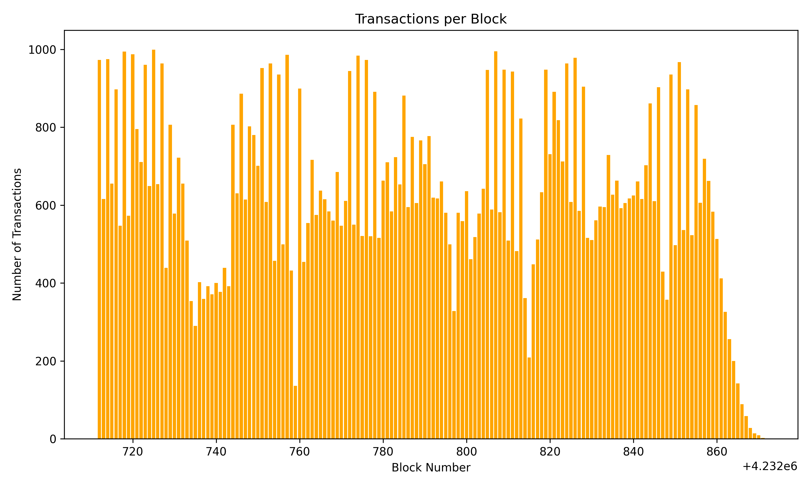

## Gas Used Over Time

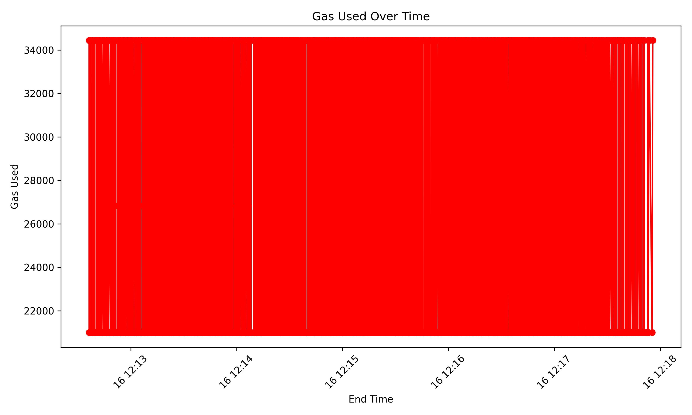

